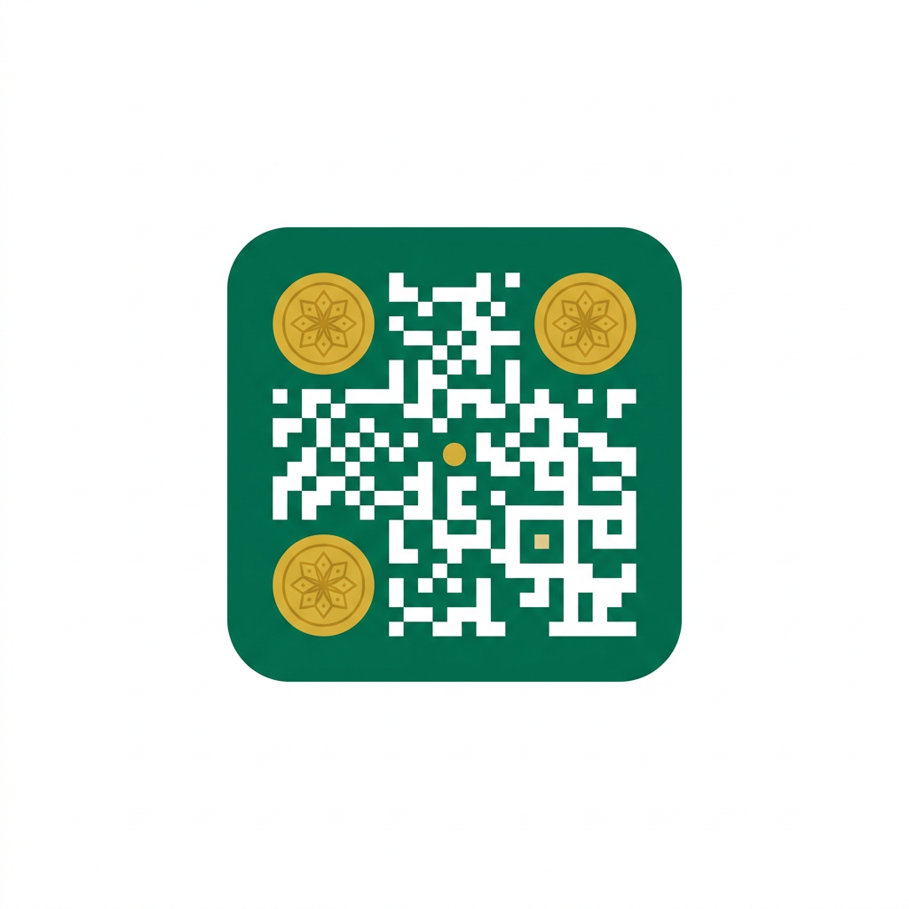

<p align="center">
  
</p>

# QrisMerchantID — Unofficial Indonesian QRIS merchant API client for Python

[](https://github.com/AlfinAI/QrisMerchantID/actions/workflows/test.yml)

[](https://pypi.org/project/QrisMerchantID/)

[](https://pypi.org/project/QrisMerchantID/)

[](LICENSE)

[](https://t.me/JoestarMojo)

[](https://github.com/AlfinAI/QrisMerchantID/discussions)

One Python package for Indonesia's QRIS merchant APIs — read your own merchant data with typed,
tested, offline-friendly code:

- 🧾 **GoPay / GoBiz** — OTP or email+password login, merchants, transactions, payouts, dynamic QRIS,
  payment watcher.
- 🛍️ **ShopeePay** — OTP login (or manual `B:` token), stores, normalized feed with issuer lookup,
  payment watcher.
- 🔬 **Researched, not guessed** — every endpoint traced to a traffic capture or a reference repo;
  unknowns are marked TODO, never shipped as fact.

Each merchant has its own guide with the full tutorial and flow diagrams:

| Provider          | Guide                        | Status                                                            |
| ----------------- | ---------------------------- | ----------------------------------------------------------------- |
| GoPay / GoBiz     | [docs/gopay/](docs/gopay/)   | ✅ auth, users, merchants, transactions, payouts, QRIS, watcher    |
| ShopeePay partner | [docs/shopee/](docs/shopee/) | ✅ OTP login, stores, transactions + issuer, watcher (`B:` or OTP) |

> Research/educational use only. Not affiliated with GoTo/GoPay/GoBiz or Shopee/Sea Group. Read-only
> by design in v0.2.0 — it only *reads* your own merchant data (login + history + payouts) and never
> moves money.

## ⚠️ Disclaimer — harap dibaca dulu

**English.** This is an **unofficial, independent research project**. It is NOT affiliated with,
endorsed by, or supported by GoTo, GoPay, GoBiz, Shopee, Sea Group, or any reference-repo author. It
is provided for **research and educational purposes only**, without warranty of any kind. Using
unofficial APIs may violate the providers' Terms of Service and can lead to rate limits, suspension,
or termination of your accounts. **You use this software entirely at your own risk — the author
(AlfinAI) shall not be liable for any loss, damage, account action, or legal consequence arising
from its use.** Credentials and tokens you enter stay on your machine (they are only ever sent to
the providers' own official servers) — never commit `.env`, `*.har`, or token/OTP cache files to any
repository.

**Bahasa Indonesia.** Ini adalah **proyek riset independen yang tidak resmi (unofficial)**. TIDAK
berafiliasi, didukung, atau disetujui oleh GoTo, GoPay, GoBiz, Shopee, Sea Group, maupun author repo
referensi mana pun. Disediakan **hanya untuk riset dan edukasi**, tanpa jaminan apa pun. Penggunaan
API tidak resmi dapat melanggar Syarat & Ketentuan penyedia dan berakibat akun dibatasi,
ditangguhkan, atau dihapus. **Segala risiko dan akibat yang timbul sepenuhnya menjadi tanggung jawab
pengguna — author (AlfinAI) tidak bertanggung jawab atas kerugian, kerusakan, tindakan terhadap
akun, atau konsekuensi hukum apa pun dari penggunaan software ini.** Kredensial/token hanya
tersimpan di mesin Anda (dan hanya dikirim ke server resmi penyedia) — jangan pernah commit file
`.env`, `*.har`, atau cache token/OTP ke repo mana pun.

## Contents

- [Installation](#installation)
- [Core concepts](#core-concepts) (money · sessions · errors)
- [Quickstart](#quickstart)
- [Provider guides](#provider-guides)
- [Roadmap](#roadmap)
- [Development](#development) · [Research](#research) · [Credits](#credits) ·
  [Contributing](#contributing) · [Contact](#contact)

## Installation

```bash
pip install QrisMerchantID
```

Requires Python 3.10+ and one dependency: [`httpx`](https://www.python-httpx.org/).

## Core concepts

Three things to understand before anything else:

1. **Money differs per provider — never mix them.** GoPay answers minor units (sen): `gross_amount:
   10600000` = Rp106.000, convert with `gopay.money.to_rupiah()`. ShopeePay answers whole rupiah as
   grouped strings: `"409.662"` = Rp409.662, parse with `shopee.money.parse_id_amount()`. Never
   guess.
2. **Sessions are yours to keep.** GoPay: cache the `access_token`, revalidate cheaply
   (`merchants.search()`); on HTTP 401, log in again. ShopeePay: log in with OTP and
   `refresh_session()` without re-OTP, or paste a manual `B:` token; on codes `200020` / `2010000`,
   renew it.
3. **Every HTTP error raises `ApiException`.** It carries `.http_status`, `.code` (when the provider
   sent one), `.payload` (full body), and a readable message. Transport errors (DNS/connect/timeout)
   retry with backoff; HTTP errors never retry.

## Quickstart

```python
from qrismerchantid import GoPayMerchant, ShopeePayPartner

# --- GoPay: OTP login (or login_with_password), then read your history ---
gopay = GoPayMerchant()
otp = gopay.auth.request_otp("0812xxxxxxx")
session = gopay.auth.login_with_otp(input("OTP: "), otp["otp_token"])
txns = gopay.transactions.analytics("G...", days=7)
print(txns["total"], "transactions")

# --- ShopeePay: token (or sp.auth OTP login), then watch a store ---
sp = ShopeePayPartner(token="B:...")   # token how-to: docs/shopee/token.md
print(sp.stores.list_stores())
watcher = sp.watch(7)
watcher.seed()
paid = watcher.wait_for_payment(409662, timeout=300)  # Rp409.662
print("PAID:", paid["id"])
```

## Provider guides

- **[GoPay / GoBiz merchant →](docs/gopay/)** — login (OTP + email/password), session cache, users,
  merchants, transactions, payouts, dynamic QRIS, payment watcher, configuration, and the
  login/payment flow diagrams.
- **[ShopeePay partner →](docs/shopee/)** — OTP login + session renewal, manual-token setup, stores,
  normalized transaction feed with issuer lookup, whole-rupiah money rules, payment watcher,
  configuration, and the payment flow diagram.

## Roadmap

- [x] GoPay provider — auth (OTP + email), merchants, transactions, payouts, QRIS, watcher.
- [x] ShopeePay provider — OTP login, stores, feed + issuer lookup, watcher.
- [ ] Live verification against real partner accounts (TODO-S1, TODO-R3) — field reports welcome in
      [Discussions](https://github.com/AlfinAI/QrisMerchantID/discussions).
- [ ] `v0.2.0` PyPI release.
- [ ] Your idea here — open a Discussion or a feature request.

## Development

```bash
pip install -e ".[dev]"
pytest          # 100% offline — never hits the real API
ruff check src tests && ruff format --check src tests
mypy src        # strict
python -m build
```

Runnable flows (need real merchant credentials via env, except QRIS): `examples/` —
`01_login_otp.py`, `02_merchants.py`, `03_transactions.py`, `04_qris_dynamic.py`,
`05_watch_payment.py`, `06_shopee_stores.py`, `07_shopee_transactions.py`, `08_shopee_watch.py`,
`09_shopee_login_otp.py`.

## Research

Full endpoint research (repos surveyed + anonymized HAR verification):
`research/RESEARCH_GOPAY_SHOPEEPAY.md` + the ShopeePay deep-dive
`research/ANALYSIS_SHOPEEPAY_PHASE_B.md` + the GoBiz OTP incident report
`research/REPORT_GOBIZ_OTP_2026-09-19.md`. Per-service pages: `docs/gopay/`, `docs/shopee/`.

**APK research knowledge base** (GoPay Merchant 2.3.0 + GoFood Merchant 5.49.0 — ±240 endpoints,
hosts, deeplinks, masked security findings):

- 📚 Start here: [KB index](docs/KB_QRIS_MERCHANT_INDEX.md) · machine-readable data in
  [`reference/`](reference/) · [agent guide](docs/KB_QRIS_MERCHANT_AGENT_GUIDE.md)
- 🔁 Reproduce it yourself / port to another language: [APK research reproduction
  guide](docs/APK_RESEARCH_REPRODUCTION_GUIDE.md)
- 🛡️ Security researchers & vendors: [responsible disclosure](docs/SECURITY_DISCLOSURE.md) (also see
  [SECURITY.md](SECURITY.md))

## Credits

API knowledge: [kavionn/gobiz-payment](https://github.com/kavionn/gobiz-payment),
[warungerik/API-GOPAY-MERCHANT](https://github.com/warungerik/API-GOPAY-MERCHANT),
[alhifnywahid/merchantid](https://github.com/alhifnywahid/merchantid),
[ahmadzakiyox/gopay-api-gateaway](https://github.com/ahmadzakiyox/gopay-api-gateaway),
[ahmadzakiyox/shoppepay-api-gateway](https://github.com/ahmadzakiyox/shoppepay-api-gateway),
[namtxs/gopay-api](https://github.com/namtxs/gopay-api). Python package maintained by AlfinAI.

## Contributing

- 🐞 Found a bug? [Open a bug
  report](https://github.com/AlfinAI/QrisMerchantID/issues/new?template=bug_report.md) — offline
  repro snippets get fixed fastest.
- 💡 Want an endpoint? [Request
  it](https://github.com/AlfinAI/QrisMerchantID/issues/new?template=feature_request.md) with a
  traffic sample or upstream link as evidence.
- 💬 Questions, ideas, show-and-tell →
  [Discussions](https://github.com/AlfinAI/QrisMerchantID/discussions).
- 🔒 Security issue? See [SECURITY.md](SECURITY.md) — never file it publicly.
- 🤝 Pull requests welcome — see [CONTRIBUTING.md](CONTRIBUTING.md).

## Contact

Questions, bug reports, or research collaboration — reach me on Telegram:
**[@JoestarMojo](https://t.me/JoestarMojo)**.

## Sponsor

If this project saves you time, consider sponsoring — it keeps the research going:

[](https://github.com/sponsors/AlfinAI)

🇮🇩 Indonesia: [Saweria](https://saweria.co/JoestarMojoTele)

## License

MIT — see [LICENSE](LICENSE).
