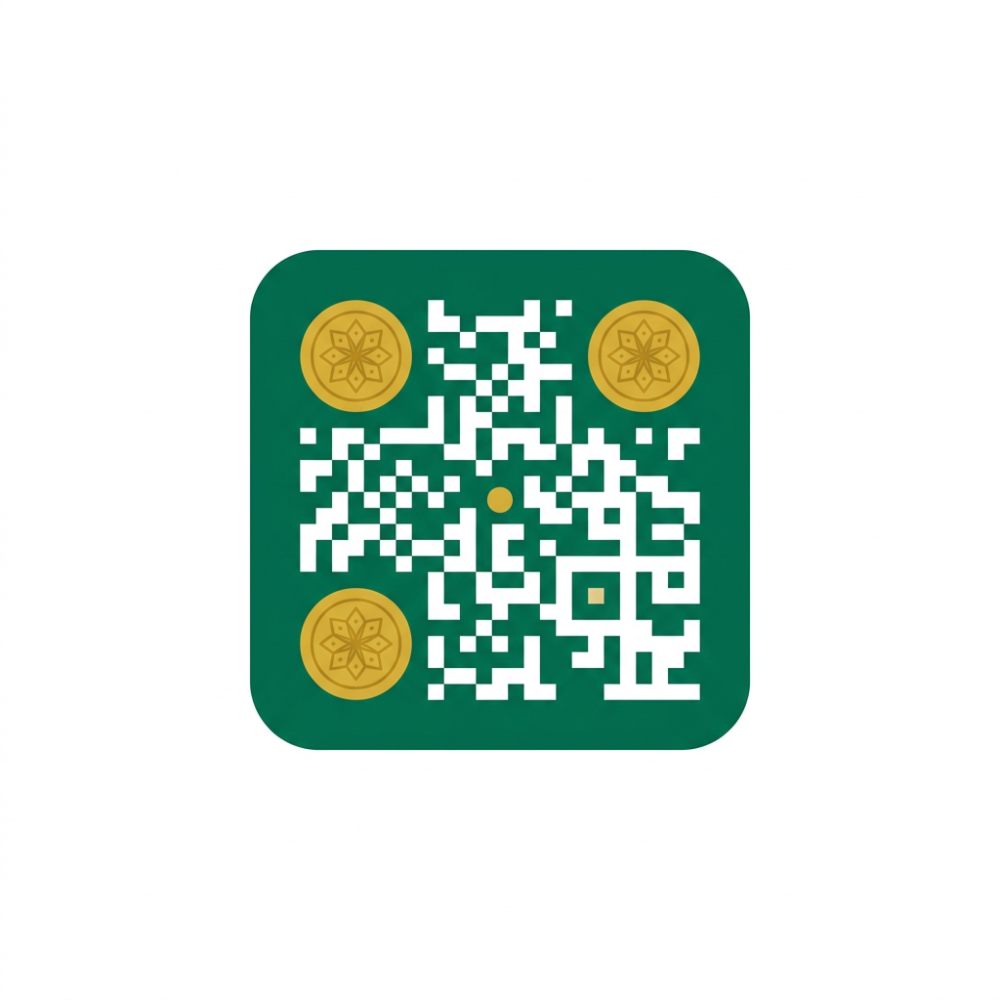

<p align="center">
  
</p>

<h1 align="center">QrisMerchantID</h1>

<p align="center">Unofficial Python client for reading Indonesian QRIS merchant data.</p>

<p align="center">
  <a href="https://github.com/AlfinAI/QrisMerchantID/actions/workflows/test.yml"></a>
  <a href="https://pypi.org/project/QrisMerchantID/"></a>
  <a href="https://pypi.org/project/QrisMerchantID/"></a>
  <a href="LICENSE"></a>
</p>

> **Important:** This is an independent research and educational project. It is not affiliated with
> GoTo, GoPay, GoBiz, Shopee, or Sea Group. It uses unofficial APIs; use it only with accounts and
> data you are authorised to access.

QrisMerchantID provides one Python interface for two merchant providers:

- **GoPay / GoBiz** — OTP or email login, merchant data, transactions, payouts, QRIS helpers, and a payment watcher.
- **ShopeePay Partner** — OTP or manual `B:` token login, stores, normalized transactions, and a payment watcher.

The library does not move money. Its QRIS helper only creates a dynamic payload locally; payment is still made through the provider's QRIS rail.

## Contents

- [Install](#install)
- [Quick start](#quick-start)
- [Choose a provider](#choose-a-provider)
- [Important concepts](#important-concepts)
- [Documentation map](#documentation-map)
- [Development](#development)
- [Safety and privacy](#safety-and-privacy)
- [Contributing](#contributing)

## Install

Requirements: Python 3.10 or newer.

```bash
python -m pip install QrisMerchantID
```

For a local checkout with development tools:

```bash
git clone https://github.com/AlfinAI/QrisMerchantID.git
cd QrisMerchantID
python -m pip install -e ".[dev]"
```

## Quick start

### GoPay / GoBiz

```python
from qrismerchantid import GoPayMerchant

gopay = GoPayMerchant()

# Request an OTP, then exchange it for a session.
challenge = gopay.auth.login(method="otp", phone_number="0812xxxxxxx")
session = gopay.auth.login(
    method="otp",
    otp=input("OTP: "),
    otp_token=challenge["otp_token"],
)

merchants = gopay.merchants.search()
merchant_id = merchants["hits"][0]["id"]
transactions = gopay.transactions.analytics(merchant_id, days=7)
print(transactions["total"], "transactions")
```

You can also use an email/password login:

```python
session = gopay.auth.login(
    method="email", email="you@example.com", password="your-password"
)
```

### ShopeePay Partner

A manual token is the shortest setup. See the [token guide](docs/shopee/token.md) for how to obtain one from your own session.

```python
from qrismerchantid import ShopeePayPartner

sp = ShopeePayPartner(token="B:...")
stores = sp.stores.list_stores()
store_id = stores[0]["id"]
feed = sp.transactions.list_recent(store_id, minutes=15)
print(len(feed["transactions"]), "transactions")
```

For programmatic OTP login, start with the [ShopeePay authentication guide](docs/shopee/auth.md).

## Choose a provider

| Provider | Best starting point | Main capabilities |
| --- | --- | --- |
| [GoPay / GoBiz](docs/gopay/README.md) | `GoPayMerchant()` | OTP/email login, merchants, analytics, payouts, QRIS, watcher |
| [ShopeePay Partner](docs/shopee/README.md) | `ShopeePayPartner(token="B:...")` | OTP/manual token, stores, transactions, watcher |

## Important concepts

### Amounts are provider-specific

Do not mix units between providers:

- GoPay transaction amounts use **minor units**. `5_000_000` means Rp50.000; use `qrismerchantid.gopay.money.to_rupiah()` when needed.
- ShopeePay normalized transactions use **whole rupiah**. `409_662` means Rp409.662; grouped strings such as `"409.662"` are parsed by `shopee.money.parse_id_amount()`.

### Sessions and secrets are your responsibility

Tokens, cookies, OTPs, and session files are sensitive. Store them outside source control, restrict file permissions, and renew or log in again when a provider rejects a session. Never put real credentials in examples, issues, pull requests, or logs.

### Errors and retries

Provider HTTP errors raise `ApiException`. It includes the HTTP status, provider code when available, and response payload. Transport failures may retry with backoff; HTTP errors are not silently retried.

### QRIS and payment watching

`qris.inject_amount()` edits a static EMVCo QRIS payload locally and recalculates its CRC. It does not confirm payment. If you poll for a payment, seed the watcher before showing the QR, poll only during an active checkout, use a unique amount when appropriate, and deduplicate the returned transaction ID in your own database.

## Documentation map

- [Documentation home](docs/README.md) — the recommended reading order.
- [GoPay overview](docs/gopay/README.md) · [authentication](docs/gopay/auth.md) · [transactions](docs/gopay/transactions.md) · [QRIS](docs/gopay/qris.md) · [watcher](docs/gopay/watcher.md).
- [ShopeePay overview](docs/shopee/README.md) · [authentication](docs/shopee/auth.md) · [manual token](docs/shopee/token.md) · [transactions](docs/shopee/transactions.md) · [watcher](docs/shopee/watcher.md).
- [Research index](research/README.md) — methodology and findings; research notes are not API guarantees.
- [APK research index](docs/KB_QRIS_MERCHANT_INDEX.md) — static observations, evidence status, and open questions.
- [Responsible disclosure](SECURITY.md) — report vulnerabilities privately.
- [Changelog](CHANGELOG.md) — release history.

## Development

Tests are offline and do not call provider APIs:

```bash
python -m pip install -e ".[dev]"
pytest
ruff check src tests
ruff format --check src tests
mypy src
python -m build
```

Runnable examples are in [`examples/`](examples/). Examples that authenticate require your own test credentials; `04_qris_dynamic.py` is local-only.

## Safety and privacy

This project is unofficial and provided without warranty. Provider terms, rate limits, account actions, and endpoint behaviour can change. You are responsible for complying with applicable laws and provider terms.

Keep `.env`, `*.har`, OTPs, passwords, access tokens, cookies, and session caches out of Git. See [SECURITY.md](SECURITY.md) and [the research disclosure guide](docs/SECURITY_DISCLOSURE.md) before sharing a finding.

## Contributing

Bug reports and feature requests are welcome. Please include the provider, a minimal offline reproduction, and sanitized response details. Do not upload secrets or live traffic captures. See [CONTRIBUTING.md](CONTRIBUTING.md), [issue templates](.github/ISSUE_TEMPLATE/), and [Discussions](https://github.com/AlfinAI/QrisMerchantID/discussions).

## License

MIT — see [LICENSE](LICENSE).
