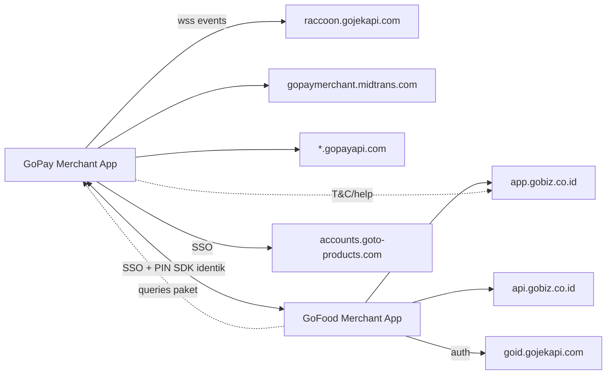

# KB — Riset Merchant QRIS Indonesia

## 1. Ringkasan eksekutif

Kita memiliki inventaris statis terverifikasi dari dua aplikasi merchant GoTo —
GoPay Merchant 2.3.0 (±150 endpoint, gateway midtrans/raccoon/gopayapi, WebSocket
realtime) dan GoFood Merchant 5.49.0 (±90 endpoint, gateway GoBiz BFF, realtime
via FCM) — yang terkonfirmasi sebagai sister apps (sertifikat `CN=Gojek`
identik + 6 endpoint PIN identik + SDK bersama). Yang belum dimiliki: bukti
runtime apa pun (host aktif, header, auth, format signing) — seluruh integrasi
menunggu capture traffic (TODO-NET-1 / TODO-DYN-1).

## 2. Peta hubungan



ASCII (fallback):

```text
GoPay Merchant App ──wss──> raccoon.gojekapi.com
        │  ├──────────────> gopaymerchant.midtrans.com
        │  └──────────────> *.gopayapi.com
        │  ══ SSO+PIN SDK ══ GoFood Merchant App ──> api.gobiz.co.id
        │                                              └─> app.gobiz.co.id
        └──── T&C/help ──> app.gobiz.co.id/com
GoFood ──auth──> goid.gojekapi.com | GoPay ──SSO──> accounts.goto-products.com
```

## 3. Tabel lookup cepat

| Cari | Buka | Kolom |
|---|---|---|
| Endpoint X (per grup) | `../reference/endpoints.csv` | `grup`, `apk_sumber` |
| Host Y (peran + staging?) | `../reference/hosts.csv` | `peran`, `catatan` |
| Kredensial (masking) | `../reference/credentials.md` | tabel item |
| Deeplink / risiko skema | `../reference/deeplinks.md` | tabel skema |
| Bukti sister-apps | `../reference/sdk_bersama.md` | tabel SDK |
| Temuan keamanan + TODO | `../reference/temuan_keamanan.csv` | `kode`, `todo` |
| Konflik kurasi | `../reference/KONFLIK.md` | TODO-KB-* |
| Laporan mentah | `../research/` | S1, S2, S3 |
| Panduan agen | `KB_QRIS_MERCHANT_AGENT_GUIDE.md` | — |

## 4. Endpoint prioritas untuk QrisMerchantID

| Prioritas | Endpoint | Sumber | Alasan |
|---|---|---|---|
| P0 | `/api/v1/unified-histories` + `/filter` | GoPay | Riwayat terpadu (target watcher) |
| P0 | `/api/v1/finance/balance/multi-wallet` | GoPay | Saldo multi-wallet |
| P0 | `/api/transactions/charge/qris-link`, `/api/v1/qris/shared` | GoPay | QRIS dinamis/link |
| P0 | `wss://gopay-merchant-raccoon.gojekapi.com/api/v1/events` | GoPay | Realtime pengganti polling |
| P1 | `/v1/payments/search` | GoFood | Kandidat BFF terpadu (lintas-app?) |
| P1 | `/v3/settlement` | GoFood | Settlement merchant |
| P1 | `/v2/charge`, `/v3/balance_inquiry`, `/v1/edc/createtoken` | GoFood | Flow charge/EDC pembanding |
| P1 | 6 path PIN identik | Keduanya | Pola auth PIN pakai-ulang |
| P2 | `/api/v1/login/complete`, `/api/v1/totp` | GoPay | Flow login merchant-app |
| P2 | `goid.gojekapi.com` + SSO | GoFood | Kandidat auth terpadu |

## 5. TODO aktif

| Kode KB | Asal | Prioritas | Owner | Isi |
|---|---|---|---|---|
| TODO-NET-1 | keduanya | P0 | user+agent | Capture traffic: host aktif + header + auth (butuh perangkat) |
| TODO-DYN-1 | keduanya | P0 | user+agent | Analisis dinamis (emulator/frida/mitmproxy) |
| GOPAY-TODO-NET-2 | GoPay | P1 | agent | Kesetaraan flow GoBiz↔merchant-app |
| GOFOOD-TODO-NET-2 | GoFood | P1 | agent | Overlap QRIS GoPay↔GoFood |
| GOPAY-TODO-NET-3 | GoPay | P1 | agent | Flow login merchant-app |
| GOFOOD-TODO-NET-3 | GoFood | P2 | agent | Mekanisme realtime (FCM?) |
| GOFOOD-TODO-NET-4 | GoFood | P2 | agent | Rules Firebase (tanpa probing) |
| GOPAY-TODO-ST-2 | GoPay | P1 | agent | Pinning GoPay (lapisan Flutter/native) |
| GOPAY-TODO-ST-4 | GoPay | P2 | agent | Flow antar-class (jadx, mesin besar) |
| GOFOOD-TODO-ST-1 | GoFood | P2 | agent | Hitungan penuh 16 dex |
| GOFOOD-TODO-ST-4 | GoFood | P2 | agent | Flow antar-class (jadx) |
| TODO-ST-3 | keduanya | P2 | agent | Dampak restriksi API key |
| TODO-ST-6 | keduanya | P2 | agent | Reverse lib `.so` tak dikenal |
| GOPAY-TODO-ST-1 | GoPay | P2 | agent | Isi `blocked_apis.js` |
| GOPAY-TODO-ST-5 | GoPay | P2 | agent | Versi Flutter |
| TODO-REL-1 | keduanya | P2 | user | Banding listing Play Store |
| TODO-REL-2 | keduanya | P2 | agent | Uji re-sign/repack |
| TODO-KB-2 | kurasi | P2 | agent | Last4 API key GoPay |
| TODO-KB-1 | kurasi | P2 | user | Review resolusi namespacing (tertutup) |

## 6. Pertanyaan riset terbuka

1. Apakah `/v1/payments/search` GoFood juga melayani data GoPay Merchant?
   (BELUM TERVERIFIKASI — butuh capture.)
2. Apakah token GoID SSO bisa dipakai lintas kedua app?
   (BELUM TERVERIFIKASI — butuh capture + uji.)
3. Bagaimana format request signing server-side? (BELUM TERVERIFIKASI —
   tidak ada static secret di client; butuh hook runtime.)
4. Apakah `/v2/charge` (GoFood/EDC) dan `/api/transactions/charge/*` (GoPay)
   berbagi semantik? (BELUM TERVERIFIKASI — GOFOOD-TODO-NET-2.)

## TODO aktif

Lihat §5 di atas.
