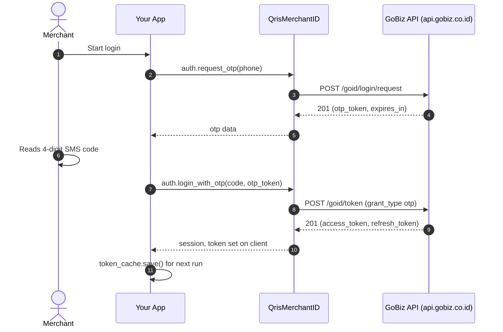
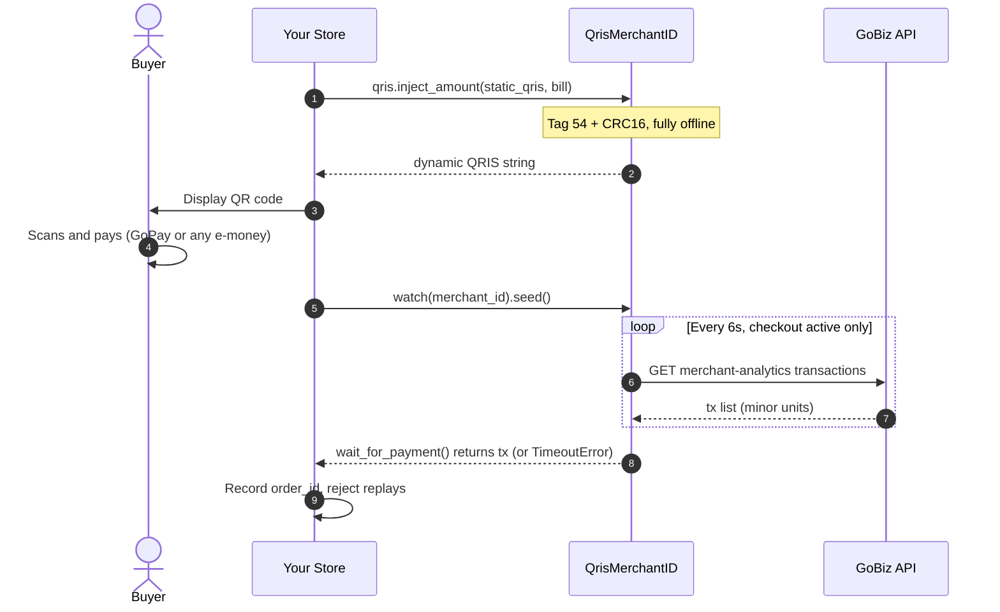

# GoPay / GoBiz merchant — provider guide

[← back to main README](../../README.md)

Everything lives on one facade sharing a single client:

```python
from qrismerchantid import GoPayMerchant

gopay = GoPayMerchant()
gopay.auth          # login: password + OTP
gopay.users         # portal profile
gopay.merchants     # search + detail
gopay.transactions  # analytics + journals + issuer breakdown
gopay.payouts       # payout history + payable balance
gopay.watch(...)    # payment watcher factory
```

Service pages: [auth](auth.md) · [merchants](merchants.md) · [transactions](transactions.md) ·
[payouts](payouts.md) · [qris](qris.md) · [watcher](watcher.md)

## 1. Login — OTP & password

GoBiz (GoID) login answers **HTTP 201** on success. Two flows:

```python
# --- One call, two methods: method="otp" (default) or method="email" ---
otp = gopay.auth.login(method="otp", phone_number="0812xxxxxxx")
# otp -> {"otp_token", "otp_expires_in", "otp_length", "next_state"}
session = gopay.auth.login(method="otp", otp=input("OTP: "), otp_token=otp["otp_token"])

# --- Email: one step (needs email+password set in portal, verified live §9.5) ---
session = gopay.auth.login(method="email", email="you@shop.id", password="secret")

session  # -> {"access_token", "refresh_token", ...} — also set on the client
```

Prefer granular calls? `request_otp()` / `login_with_otp()` / `login_with_password()` do the
same steps individually — see [auth.md](auth.md).

Notes (all verified against a live portal capture, research §9):

- `request_otp()` sends **no `login_type` field** — the portal doesn't either. (Some reference repos
  send one; the server ignores it.)
- Phone numbers are normalized to bare national format (`"0812…"`, `"+62812…"`, `"62812…"` →
  `"812…"`); garbage raises `ValueError`. `country_code` defaults to `"62"`.
- Keep `otp_token` server-side between the two calls (or `token_cache.save_pending_otp()`); it
  expires with the code.

## 2. Session cache

Skip OTP on the next run by caching the session to disk:

```python
from qrismerchantid.core import token_cache

token_cache.save(".gopay-session.json", session)

session = token_cache.load(".gopay-session.json")  # None if missing/invalid
gopay = GoPayMerchant(access_token=session["access_token"]) if session else GoPayMerchant()
```

Recommended loop for long-running gateways: load cache → cheap `merchants.search()` probe → on 401,
login again and re-save. See [examples/01_login_otp.py](../../examples/01_login_otp.py) and
[examples/02_merchants.py](../../examples/02_merchants.py).

## 3. Users & merchants

```python
me = gopay.users.me()
# -> {"user": {"id", "email", "full_name", "phone", "roles", "scopes", ...}}

found = gopay.merchants.search()            # {"total", "success", "hits"}
found = gopay.merchants.search(from_=40, size=5)
merchant_id = found["hits"][0]["id"]        # IDs look like "G…"

detail = gopay.merchants.detail(merchant_id)
# -> full object: KYC, outlet, bank, active_payment_channels, payment_settings…
```

`search()` doubles as the token-validity probe used by every reference gateway.

## 4. Transactions

The primary feed is **merchant-analytics** (query shape verified 1:1):

```python
txns = gopay.transactions.analytics(merchant_id, days=7)
txns = gopay.transactions.analytics(
    merchant_id, start_time="2026-09-01T00:00:00.000Z", end_time="2026-09-08T00:00:00.000Z"
)
txns = gopay.transactions.analytics(["G111", "G222"], days=1, size=50)  # multi-outlet
# -> {"from", "size", "total", "transactions": [...]}
```

Each transaction carries 23 keys, including `order_id` (`QRIS-…`), `transaction_status`
(`SETTLEMENT`/`CAPTURE`/`REFUND`/`PARTIAL_REFUND`), `payment_type`, `channel_type` (`STATIC_QR`),
`transaction_source` (`GOPAY_INSTORE`), `qris_provider_aspi_issuer`/`…_acquirer`, `shares`,
`promo_details`. Defaults mirror the portal exactly (`statuses=SETTLEMENT,…`,
`payment_types=QRIS,GOPAY,…`) and are overridable.

Two more reads on `/journals/search` (special journal headers handled for you):

```python
journal = gopay.transactions.journals(merchant_id, start, end, size=50)
by_issuer = gopay.transactions.qris_issuer_breakdown(start, end)
# -> {"aggregations": {"by_qris_issuer": {"buckets": [...]}}}
```

## 5. Payouts

HAR-discovered endpoints — absent from every reference repo:

```python
page = gopay.payouts.list()              # ?page=1&per=10
page = gopay.payouts.list(page=2, per=25)
# -> {"payouts": [{"payout_id", "net_amount", "gross_amount", "status": "paid",
#      "paid_at", "account_no", ...}], "current_page", "per", "next_page"}

payable = gopay.payouts.payable_detail(merchant_id)
# -> {"payable_detail": {"payable", "net_amount", "total_settlement", fees…}}
```

Amounts here are **decimal strings in minor units** — `to_rupiah("11610000.0")`.

## 6. QRIS dynamic

Pure offline helpers (`qrismerchantid.gopay.qris`): parse a static QRIS as EMVCo TLV, set tag `54`
to the bill, recompute **CRC16-CCITT**, done:

```python
from qrismerchantid.gopay import qris

qris.get_tag(static_qris, "59")          # merchant name, e.g. "NUXYS STORE"
dynamic = qris.inject_amount(static_qris, 50000)  # Rp50.000, CRC valid
qris.get_tag(dynamic, "54")              # "50000"
```

Render `dynamic` with any QR library (`qrcode`, `segno`) and display it at checkout. **Anti
double-claim** (when two buyers pay the same nominal at once): add a unique code (Rp1–99) to the
bill and dedupe by the watcher's `transaction_id`/`order_id` on your side — the same recipe every
gateway uses.

## 7. Payment watcher

The classic gateway loop, ported from `gobiz.js`: seed → poll → match nominal:

```python
watcher = gopay.watch(merchant_id)  # poll_interval=6.0 like the references
watcher.seed()                      # mark current history as seen, returns count

paid = watcher.wait_for_payment(5_000_000, timeout=300)  # Rp50.000 in minor units
paid = watcher.wait_for_payment(5_000_000, timeout=300, tolerance=100)
# -> raw transaction dict; raises TimeoutError when the invoice lapses
```

Lower-level: `watcher.poll_once()` returns only never-seen transactions (seen cache capped at 500).
Polling etiquette: keep the 6s interval, poll only while a checkout is active — aggressive polling
is how accounts get rate-limited.

## 8. Configuration

```python
gopay = GoPayMerchant(
    access_token="...",
    timeout=30.0,       # seconds
    max_retries=2,      # transport errors only — never HTTP errors
    backoff_base=0.5,   # exponential: 0.5s, 1s, 2s, ...
    app_version="platform-v3.122.0-72edb090",  # default follows the analyzed portal
    user_agent="...",
)
```

Need HTTP/2, a proxy, or a custom CA? Pass your own transport:

```python
import httpx
from qrismerchantid.core.transport import HttpxTransport

transport = HttpxTransport(httpx.Client(http2=True, proxy="http://localhost:8080"))
gopay = GoPayMerchant(transport=transport)
```

## Merchant flows

How money moves through GoPay, end to end. (GitHub renders these as diagrams automatically.)

### GoPay login — OTP



### GoPay payment — dynamic QRIS + watcher



## Contact

Questions about this provider? Telegram: [@JoestarMojo](https://t.me/JoestarMojo).
