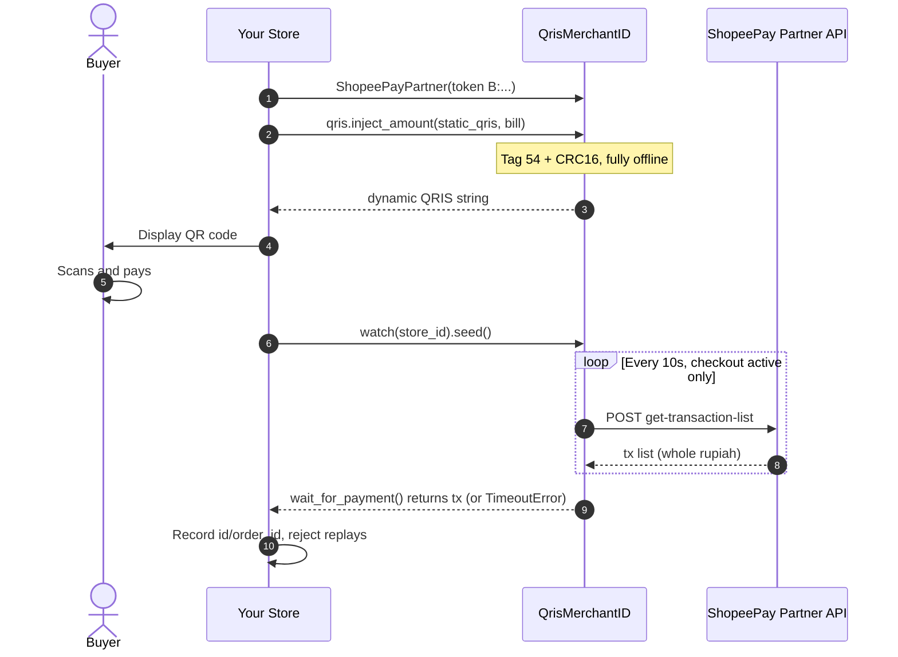

# ShopeePay partner — provider guide

[← back to main README](../../README.md)

Manual-token provider (B1): paste a `B:...` token from your own portal session, then one facade
sharing a single client. Programmatic OTP login arrives in FASE B2.

```python
from qrismerchantid import ShopeePayPartner

sp = ShopeePayPartner(token="B:...")   # or ShopeePayPartner() + sp.set_token(...)
sp.stores         # list_stores() — cursor-paged discovery
sp.transactions   # list_recent(store_id) — normalized feed
sp.watch(...)     # payment watcher factory (store-scoped)
```

Service pages: [auth](auth.md) · [token](token.md) · [stores](stores.md) ·
[transactions](transactions.md) · [watcher](watcher.md) · [device-risk](device-risk.md)

## 1. Login — OTP (or manual token)

Two ways to authenticate. Programmatic OTP login (B2):

```python
challenge = sp.auth.request_otp("0812xxxxxxx", password="...")  # + device_report, see below
outcome = sp.auth.login_with_otp(challenge, input("OTP: "))
# -> {"status": "complete", "session": {...}}  (or "merchant-selection-required")
session = outcome["session"]

import json
json.dump(session, open(".shopee-session.json", "w"))  # persist: cookies + token inside

# next run: restore + renew without OTP
session = json.load(open(".shopee-session.json"))
session = sp.auth.refresh_session(session)   # raises when only a fresh OTP recovers
sp.set_token(session["token"])
```

Multi-merchant accounts without `merchant_id=` stop at `"merchant-selection-required"` — show
`outcome["merchants"]`, then `sp.auth.complete_login(outcome["verification"], merchant_id=...)`. No
second OTP needed. Full guide: [auth.md](auth.md).

> **OTP delivery needs telemetry.** Without a `device_report` blob the issuer returns a degraded
> risk token and Shopee silently withholds the code. Capture the blob from YOUR own browser —
> [device-risk.md](device-risk.md). No shared blob is shipped with this package, deliberately.

Alternative: paste a manual `B:` token ([token.md](token.md)) — 2 minutes, no login flow, but
re-paste on every rotation.

## 2. Stores

```python
stores = sp.stores.list_stores()
# -> [{"id": "7", "name": "My Shop", "status": 1}, ...]
```

`list_stores()` walks the `lastStoreId` cursor until the batch runs short (or `storeCount` is
reached). When the `[1, 10]` service filter yields zero stores, it retries once with the filter
omitted entirely — stores without a service still show up. Keep the numeric `id`: the feed and the
watcher are store-scoped.

## 3. Transactions

```python
feed = sp.transactions.list_recent(7, minutes=15)
feed = sp.transactions.list_recent(7, start_time=1784050000, end_time=1784053600)
# -> {"transactions": [...], "pages_fetched": 1, "truncated": False}
```

Each transaction is normalized:

```python
{
    "id": "264693445089687719",   # 18-digit transactionId
    "order_id": "EXT-1",          # external -> display -> transactionId fallback
    "amount_idr": 409662,         # WHOLE rupiah (see below!)
    "create_time": 1784050000,    # epoch seconds
    "create_time_iso": "2026-07-14T17:26:40.000Z",
    "store_id": "7",
    "merchant_id": "42",
    "status": 3,
    "completed": True,            # only status == 3 counts
    "payment_type": "shopee:1",
    "raw": {...},                 # untouched wire row
}
```

Three things that differ from GoPay: amounts are **whole rupiah** (the wire sends grouped strings —
`"409.662"` = Rp409.662 — parsed with `shopee.money.parse_id_amount()`, never minor units); time
filters are **epoch seconds**; the feed is **cursor-paged** (`next_position`, page cap 10).

Scope & safety: rows from other stores are dropped (`merchant_id=` adds a second check),
`transactionId` dedupes across pages, malformed rows are skipped (never guessed), and a
non-advancing cursor raises instead of looping.

## 4. Payment watcher

Same seed → poll → match-nominal shape as GoPay, but amounts are whole rupiah and only `completed`
transactions match:

```python
watcher = sp.watch(7)   # store_id; poll_interval=10.0 like the reference gateway
watcher.seed()          # mark current history seen -> count
fresh = watcher.poll_once()  # only never-seen txs (seen cache capped at 500)

paid = watcher.wait_for_payment(409662, timeout=300)              # Rp409.662
paid = watcher.wait_for_payment(409662, timeout=300, tolerance=100)
# -> normalized tx dict; raises TimeoutError when the invoice lapses
```

Gateway recipe:

1. `qris.inject_amount(static_qris, bill)` (+ unique code Rp1–99) → show QR. (Reuse
   `qrismerchantid.gopay.qris` — EMVCo injection is provider-agnostic.)
2. `watcher.seed()` when the checkout opens.
3. `wait_for_payment(bill_idr, timeout=300)` → on success, record the `id` / `order_id` in YOUR
   database and reject replays; on `TimeoutError`, expire the invoice.

Etiquette: poll only while a checkout is active (~10s cadence) — the reference gateway scales
requests with active buyers and sends zero when the shop is quiet. Hammering the feed is how tokens
get rate-limited.

## 5. Configuration

```python
sp = ShopeePayPartner(
    token="B:...",
    timeout=30.0,       # seconds
    max_retries=2,      # transport errors only — never HTTP errors
    backoff_base=0.5,   # exponential: 0.5s, 1s, 2s, ...
    language="id",      # data.metadata locale
    timezone="Asia/Jakarta",
    user_agent="...",
)
```

Need HTTP/2, a proxy, or a custom CA? Pass your own transport:

```python
import httpx
from qrismerchantid.core.transport import HttpxTransport

transport = HttpxTransport(httpx.Client(http2=True, proxy="http://localhost:8080"))
sp = ShopeePayPartner(token="B:...", transport=transport)
```

## Merchant flow

How money moves through ShopeePay, end to end. (GitHub renders this as a diagram automatically.)



## Contact

Questions about this provider? Telegram: [@JoestarMojo](https://t.me/JoestarMojo).
